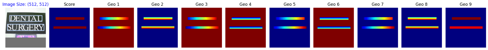
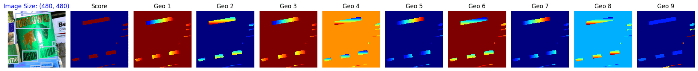

# EASTAD
An Efficient and Accurate Scene Text Detector (https://arxiv.org/pdf/1704.03155v2)


```bash
python main.py --yaml_config configs/icdar15.yaml
```

## Info
+ Dataset augmentation options include YOLO-style augmentation (yolo_aug) and SSD-style augmentation (ssd_aug).
+ Model performance evaluation is available using Hmean metrics.
+ In addition to dataset augmentation, the data creation process can filter out text with small height and width, eliminating overly small text.
+ The generated data can be scaled to various size ratios during the process.
+ The model predicts the four corners of the text, and the dataset includes an additional channel used to assign higher weights to small-sized text, helping the model pay more attention to them. This is because the model often struggles to detect small-sized text. This weighting is applied during the loss calculation.

## Demo
Dataset Augmentation:
+ SSD Augmentation


+ Yolo Augmentation


Model Performance Evaluation
+ Hmean metric:
<p align='center'>
    
</p>

## Demo

### Test .pth & .onnx Model
```bash
voila "test_model.ipynb" --port 8866 --Voila.ip 127.0.0.1 --show_tracebacks=True
```

## Installation

To use these applications, you need to have Python and several Python packages installed. To install the required packages, use the following command:
```bash
pip install -r requirements.txt"
```